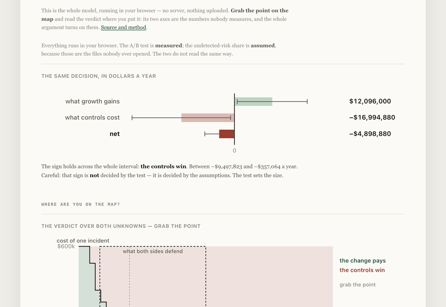

# Both sides are right, and that isn't enough

A change to onboarding makes conversion rise and alerts rise. Growth brings an A/B test,
controls bring a projection, and the two never share an axis. This tool puts them on one —
in dollars a year, with the uncertainty carried through — and then answers the question the
meeting never asks: **can this evidence decide the sign at all?**

<!-- figures:finding -->
**The finding.** The A/B test settles that conversion rises — 2.10 % [0.15 % … 4.04 %]. It does **not** settle the decision. The sign of the net is set by an assumption nobody measures, and it flips at an undetected-risk share of **1.33 %** — inside the range both functions are prepared to defend. Running the test larger cannot settle it; measuring that share can.
<!-- /figures:finding -->

**[Try it in your browser →](https://arslanesempai-ui.github.io/growth-versus-controls/)** —
grab the point on the map and read the verdict where you put it. Nothing is uploaded.



```bash
npm run arbitrer     # the verdict, the flip point, and what would settle it
npm run figures      # regenerate the blocks in this README from the model
npm test             # types, borrowed models, and <!--p:portfolio.parDepot.arbitrage-->39<!--/p--> tests
```

---

## The decision, from both sides

<!-- figures:decision -->
|  | A year | Interval |
|---|---|---|
| What growth gains | $12,096,000 | $881,640 … $23,298,328 |
| What controls cost | −$10,886,400 | −$21,030,495 … −$793,476 |
| **Net** | **$1,209,600** | **$88,164 … $2,267,833** |

The sign holds across the interval, and it is decided by **the assumptions**, not the other one.
<!-- /figures:decision -->

The interval comes from the test and nowhere else. It is computed with Newcombe's hybrid
score method rather than by subtracting two Wilson intervals — the naive version is wider,
which looks cautious and is simply wrong. Its coverage is checked by simulation in the test
suite, not taken from a remembered example.

## Capacity is bought whole

<!-- figures:marche -->
Customers gained lie between **367** and **9,708** a year. Analysts to hire across that interval: **0** at the low end, **1** at the high end. The same test therefore says both "costs nothing extra" and "costs a whole salary" — not a contradiction, a step. Capacity is bought whole.
<!-- /figures:marche -->

This is why two institutions with the same measurement and the same assumptions can decide
the opposite way and both be right: what matters is where their team already sits on the
staircase. A model that charges analyst hours at an hourly rate hires three tenths of a
person and cannot say this. The capacity assumptions are borrowed from
[alert-triage-economics](https://github.com/ArslaneSempai-ui/alert-triage-economics), byte
for byte, not rewritten from memory.

## What would settle it

<!-- figures:leviers -->
| Effort | Interval width left | Settles it? |
|---|---|---|
| run the test 4× larger | $1,121,022 | no |
| measure the undetected share instead of assuming it | $0 | **yes** |
<!-- /figures:leviers -->

Enlarging the test is what the room always asks for. Here it narrows an interval whose sign
never depended on it: as long as the test says conversion rises, the customers-gained
interval is entirely positive, so the sign of the net is the sign of the per-customer
margin — and the margin is made of assumptions.

## Where every number comes from

<!-- figures:provenance -->
|  | Input | What it is | Why it is that kind |
|---|---|---|---|
| measured | `test` | conversion lift, from the A/B test | counts, not a rate: the interval comes from the sample size |
| assumed | `visiteursParAn` | annual traffic on the touched step | a planning figure, stable within a quarter |
| assumed | `revenuParClient` | annual revenue per retained customer |  |
| assumed | `partAlertante` | share of gained customers that will alert | observable after the fact, never before |
| assumed | `minutesParAlerte` | analyst minutes per alert | the one control-side figure a team usually does know |
| assumed | `partNonDetectee` | share of gained customers who are a real risk and go undetected | the marginal population, not the book: these are the customers the control was stopping. Swept, not guessed. |
| assumed | `croyance` | the range the two functions will each defend for that share | not a confidence interval — nobody measured. It is what each side is prepared to argue. |
| chosen | `coutRisqueNonDetecte` | cost of one undetected risk | fines, remediation and exit, averaged; a choice, and the verdict moves with it |

**retrieved** — a public source says this, on the date recorded, in words linked from the page  
**measured** — running the code in this repository produces it  
**assumed** — an input nobody here can know; yours to supply  
**chosen** — my judgement and nothing else
<!-- /figures:provenance -->

The undetected-risk share deserves a note of its own. It is **not** the book's risk rate.
The customers this change gains are exactly the ones the control was stopping, so their risk
rate is that of the marginal population, not the average. Using the book rate here assumes
the control being removed was doing nothing — which is the conclusion, not the premise.

## What this does not let you conclude

**Not "the change is worth it."** It is worth it at the assumed undetected-risk share, and
that share is assumed. The tool reports where the sign flips precisely so that nobody has to
pretend otherwise.

**Not "compliance is being unreasonable."** Two thirds of the range both sides defend
favours the controls. The point estimate and the range disagree, and both readings are
reported.

**Not "the A/B test was a waste."** It establishes the size of the prize, which is worth
knowing. It just cannot establish the sign, and a tool that let people believe otherwise
would cost them six weeks of extra traffic for nothing.

**Not a general result.** One change, one institution's volumes, one set of prices. What
transfers is the method: put both functions in the same unit, propagate the measured
uncertainty, and name the assumption that decides the sign.
